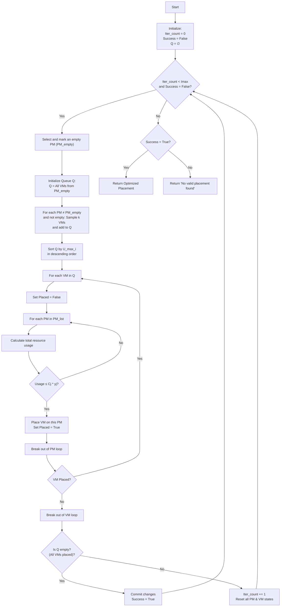

# VM Placement Optimization Algorithm

This flowchart describes a heuristic algorithm for optimizing the placement of Virtual Machines (VMs) on Physical Machines (PMs) to consolidate workload and free up servers.

## Flowchart

## Explanation
This algorithm attempts to find a new VM arrangement to free up at least one target physical server (`PM_empty`).

- **Imax:** Maximum number of iterations to attempt.
- **k:** The number of VMs to randomly sample from each non-empty PM.
- **U_max_i:** The maximum resource utilization of VM *i* (e.g., CPU usage).
- **Cj * yj:** The total resource capacity of PM *j*.
- **Queue Q:** A collection of VMs that need to be re-placed.
- The inner loops try to find a new home for each VM in the sorted queue `Q`.
- If all VMs in `Q` can be placed, the algorithm succeeds.
- If any VM cannot be placed, the algorithm resets and tries again.
